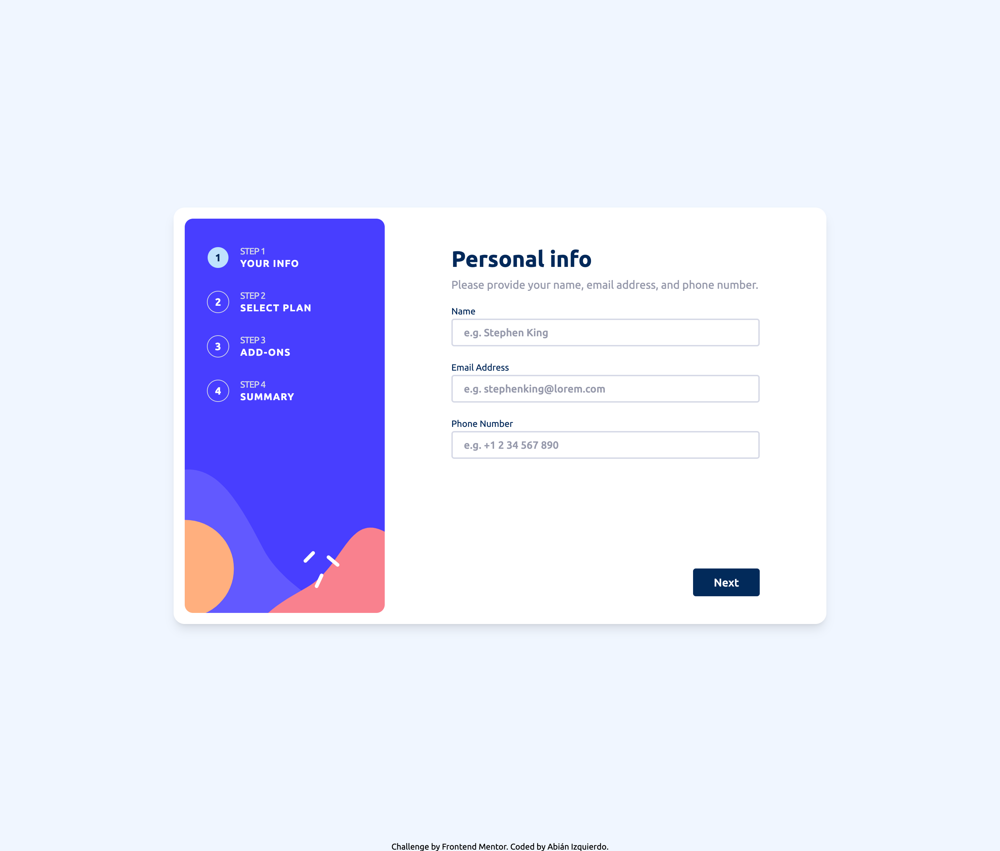

# Frontend Mentor - Multi-step form solution

This is a solution to the [Multi-step form challenge on Frontend Mentor](https://www.frontendmentor.io/challenges/multistep-form-YVAnSdqQBJ). Frontend Mentor challenges help you improve your coding skills by building realistic projects.

## Table of contents

- [Frontend Mentor - Multi-step form solution](#frontend-mentor---multi-step-form-solution)
  - [Table of contents](#table-of-contents)
  - [Overview](#overview)
    - [The challenge](#the-challenge)
    - [Screenshot](#screenshot)
    - [Links](#links)
  - [My process](#my-process)
    - [Built with](#built-with)
  - [Author](#author)

**Note: Delete this note and update the table of contents based on what sections you keep.**

## Overview

### The challenge

Users should be able to:

- Complete each step of the sequence
- See a summary of their selections on the final step and confirm their order
- View the optimal layout for the interface depending on their device's screen size
- See hover and focus states for all interactive elements on the page

### Screenshot

### Links

- Solution URL: [https://github.com/abizmo/multi-step-form](https://github.com/abizmo/multi-step-form)
- Live Site URL: [https://multi-step-form-abizmo.vercel.app/](https://multi-step-form-abizmo.vercel.app/)

## My process

### Built with

- Semantic HTML5 markup
- Flexbox
- CSS Grid
- Mobile-first workflow
- [React](https://reactjs.org/)
- [Vite.js](https://vitejs.dev/)
- [TailwindCSS](https://tailwindcss.com/)

## Author

- Website - [Abián Izquierdo](https://www.abizmo.dev)
- Frontend Mentor - [@abizmo](https://www.frontendmentor.io/profile/abizmo)
- Github - [@abizmo](https://www.github.com/abizmo)

**Note: Delete this note and add/remove/edit lines above based on what links you'd like to share.**
